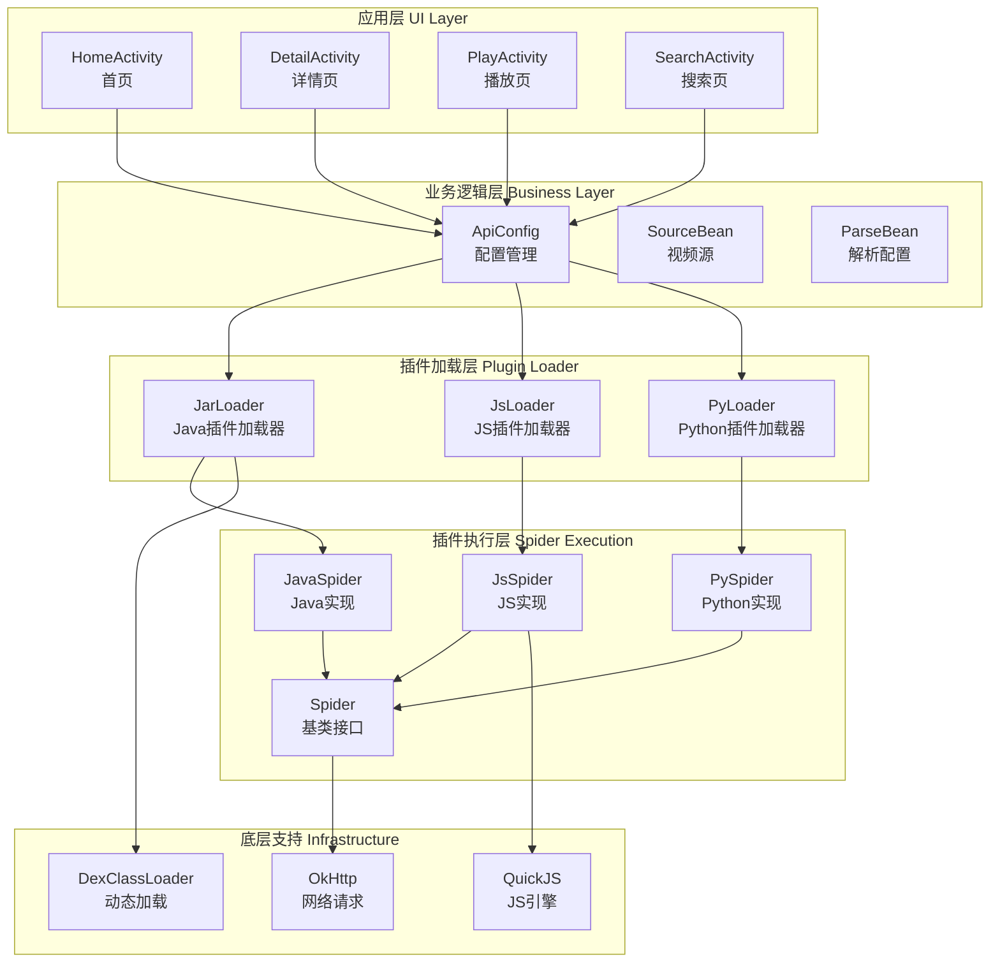
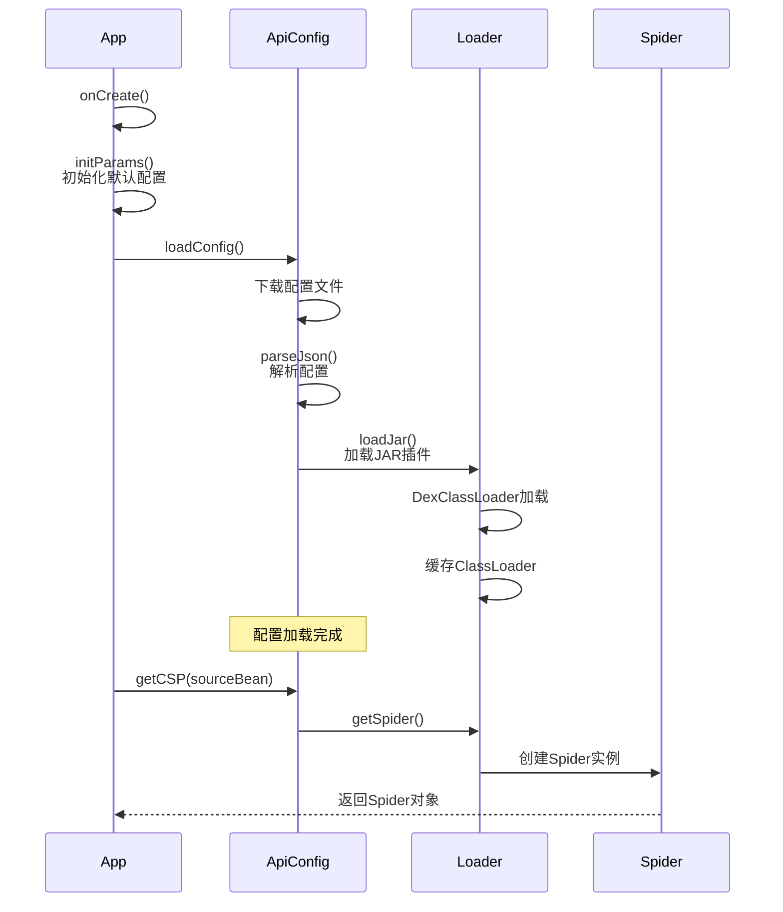
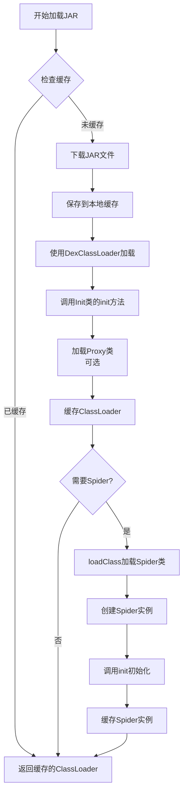
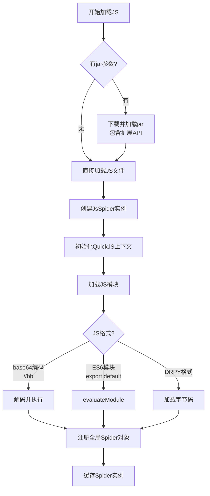
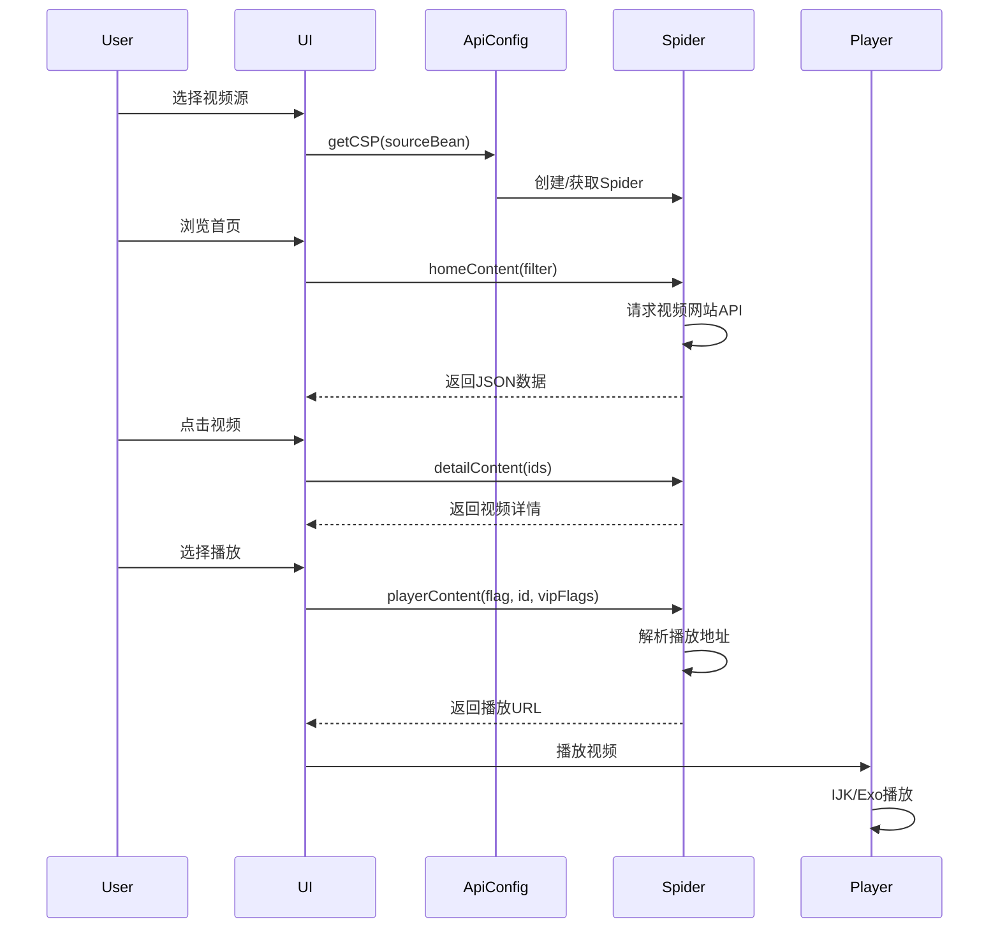
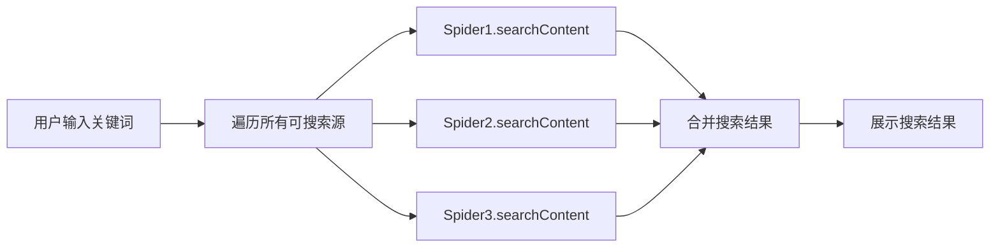

# TvBox 项目分析报告

## 项目概况

**TvBox** 是一个基于 Android TV 的视频播放应用程序（TVBox），主要用于聚合和播放各种在线视频内容。该项目采用了**插件化架构**，支持通过外部配置文件动态加载视频源（Spider）。

### 核心特点
- **多格式支持**: 支持 IJK、Exo、系统播放器等多种播放器
- **插件化**: 支持 Java/JAR、JavaScript、Python 三种类型的爬虫插件
- **动态配置**: 通过 JSON 配置文件动态加载视频源
- **Android TV 优化**: 专为电视大屏设计的横屏界面
- **直播功能**: 支持 IPTV 直播频道

---

## 项目架构

### 模块组成

```
Box/
├── app/                          # 主应用模块
│   ├── src/main/java/
│   │   └── com/github/tvbox/osc/
│   │       ├── api/             # API配置管理
│   │       ├── base/            # 应用基础类
│   │       ├── player/          # 播放器相关
│   │       ├── ui/              # 用户界面
│   │       └── util/            # 工具类
│   └── src/main/assets/         # 资源文件
├── quickjs/                     # QuickJS JavaScript引擎
└── pyramid/                     # Python支持模块
```

### 整体架构图



---

## 运行原理

### 应用启动流程



### 核心运行机制

#### 1. 配置管理 ([ApiConfig.java](file:///home/yimeng/boxext/Box/app/src/main/java/com/github/tvbox/osc/api/ApiConfig.java))

`ApiConfig` 是整个应用的配置中心，负责：

- **配置加载**: 从远程URL或本地缓存加载JSON配置
- **配置解析**: 解析视频源、解析器、直播源等配置
- **插件管理**: 根据视频源类型调用相应的加载器
- **缓存管理**: 使用MD5哈希缓存配置文件

**关键方法**:
```java
// 加载配置
public void loadConfig(boolean useCache, LoadConfigCallback callback, Activity activity)

// 加载JAR插件
public void loadJar(boolean useCache, String spider, LoadConfigCallback callback)

// 获取Spider实例
public Spider getCSP(SourceBean sourceBean)
```

#### 2. 数据持久化

使用 **Hawk** 库进行配置持久化存储：

```java
// 默认配置写入
private void putDefault(String key, Object value) {
    if (!Hawk.contains(key)) {
        Hawk.put(key, value);
    }
}
```

主要配置项包括：
- `HOME_REC`: 首页推荐类型（豆瓣/站点推荐/历史）
- `PLAY_TYPE`: 播放器类型（系统/IJK/Exo）
- `IJK_CODEC`: IJK解码方式（软解码/硬解码）
- `HOME_NUM`: 历史记录数量
- `DOH_URL`: DNS over HTTPS设置

#### 3. 网络请求

使用 **OkGo** 封装的 OkHttp 进行网络请求：

- 配置文件下载
- JAR/JS/Python文件下载
- 视频源API调用
- 支持DoH（DNS over HTTPS）

---

## 插件机制详解

Box 的核心是其强大的插件系统，支持三种类型的爬虫插件：

### Spider 基类接口

所有插件都需要实现 [Spider.java](file:///home/yimeng/boxext/Box/app/src/main/java/com/github/catvod/crawler/Spider.java) 基类定义的接口：

```java
public class Spider {
    // 初始化
    public void init(Context context, String extend) throws Exception
    
    // 首页内容
    public String homeContent(boolean filter) throws Exception
    
    // 首页视频
    public String homeVideoContent() throws Exception
    
    // 分类内容
    public String categoryContent(String tid, String pg, boolean filter, 
                                  HashMap<String, String> extend) throws Exception
    
    // 详情内容
    public String detailContent(List<String> ids) throws Exception
    
    // 搜索内容
    public String searchContent(String key, boolean quick) throws Exception
    
    // 播放信息
    public String playerContent(String flag, String id, 
                               List<String> vipFlags) throws Exception
    
    // 本地代理
    public Object[] proxyLocal(Map<String, String> params) throws Exception
}
```

### 1. Java/JAR 插件机制

#### 加载器: [JarLoader.java](file:///home/yimeng/boxext/Box/app/src/main/java/com/github/catvod/crawler/JarLoader.java)

**工作流程**:



**关键代码**:

```java
public class JarLoader {
    // ClassLoader缓存
    private final ConcurrentHashMap<String, DexClassLoader> classLoaders;
    
    // Spider实例缓存
    private final ConcurrentHashMap<String, Spider> spiders;
    
    // 加载JAR并初始化
    private boolean loadClassLoader(String jar, String key) {
        File cacheDir = new File(App.getInstance().getCacheDir() + "/catvod_csp");
        DexClassLoader classLoader = new DexClassLoader(jar, 
            cacheDir.getAbsolutePath(), null, App.getInstance().getClassLoader());
        
        // 加载Init类并调用init方法
        Class<?> classInit = classLoader.loadClass("com.github.catvod.spider.Init");
        Method initMethod = classInit.getMethod("init", Context.class);
        initMethod.invoke(null, App.getInstance());
        
        // 加载Proxy类（可选）
        Class<?> proxy = classLoader.loadClass("com.github.catvod.spider.Proxy");
        Method proxyMethod = proxy.getMethod("proxy", Map.class);
        
        classLoaders.put(key, classLoader);
        return true;
    }
    
    // 获取Spider实例
    public Spider getSpider(String key, String cls, String ext, String jar) {
        // 移除"csp_"前缀
        String clsKey = cls.replace("csp_", "");
        
        // 加载Spider类
        Spider sp = (Spider) classLoader.loadClass(
            "com.github.catvod.spider." + clsKey).newInstance();
        sp.init(App.getInstance(), ext);
        
        spiders.put(key, sp);
        return sp;
    }
}
```

**特点**:
- 使用 `DexClassLoader` 动态加载外部JAR
- 支持MD5校验确保文件完整性
- 三级缓存策略：ClassLoader缓存、Spider实例缓存、文件缓存
- 支持自定义初始化（Init类）和代理（Proxy类）

### 2. JavaScript 插件机制

#### 加载器: [JsLoader.java](file:///home/yimeng/boxext/Box/app/src/main/java/com/github/catvod/crawler/JsLoader.java)

**核心技术**: 使用 **QuickJS** JavaScript引擎执行JS代码

**工作流程**:



#### 实现: [JsSpider.java](file:///home/yimeng/boxext/Box/app/src/main/java/com/github/tvbox/osc/util/js/JsSpider.java)

**QuickJS 集成**:

```java
public class JsSpider extends Spider {
    private QuickJSContext ctx;
    private JSObject jsObject;
    private final ExecutorService executor;
    
    // 初始化QuickJS上下文
    private void createCtx() {
        ctx = QuickJSContext.create();
        
        // 设置模块加载器
        ctx.setModuleLoader(new QuickJSContext.BytecodeModuleLoader() {
            @Override
            public byte[] getModuleBytecode(String moduleName) {
                String content = FileUtils.loadModule(moduleName);
                // 支持多种格式
                if (content.startsWith("//DRPY")) {
                    return Base64.decode(content.replace("//DRPY",""), URL_SAFE);
                } else if (content.startsWith("//bb")) {
                    return byteFF(Base64.decode(content.replace("//bb",""), 0));
                } else {
                    return ctx.compileModule(content, moduleName);
                }
            }
        });
        
        // 绑定全局对象
        ctx.getGlobalObject().bind(new Global(executor));
        
        // 注入网络请求能力
        ctx.getGlobalObject().evaluate(FileUtils.loadModule("net.js"));
    }
    
    // 调用JS方法
    private Object call(String func, Object... args) {
        return executor.submit(() -> 
            Async.run(jsObject, func, args).get()
        ).get();
    }
    
    // 实现Spider接口
    @Override
    public String homeContent(boolean filter) {
        return (String) call("home", filter);
    }
}
```

**特点**:
- 使用单线程 ExecutorService 执行所有JS调用，保证线程安全
- 支持ES6模块系统
- 支持base64编码的JS代码（加密保护）
- 可选的jar扩展，提供额外的Java API给JS调用
- 内置网络请求、JSON解析等能力

### 3. Python 插件机制

#### 接口: [IPyLoader.java](file:///home/yimeng/boxext/Box/app/src/main/java/com/github/catvod/crawler/python/IPyLoader.java)

```java
public interface IPyLoader {
    void clear();
    void setConfig(String jsonStr);
    void setRecentPyKey(String pyApi);
    Spider getSpider(String key, String cls, String ext);
    Object[] proxyInvoke(Map<String, String> params);
}
```

**特点**:
- 通过 `pyramid` 模块提供Python运行环境
- 支持Python脚本动态加载和执行
- 需要额外的Python解释器支持

### 插件类型判断

在 [ApiConfig.java](file:///home/yimeng/boxext/Box/app/src/main/java/com/github/tvbox/osc/api/ApiConfig.java#L739-L747) 中根据API路径判断插件类型：

```java
public Spider getCSP(SourceBean sourceBean) {
    String api = sourceBean.getApi();
    
    // JavaScript插件
    if (api.endsWith(".js") || api.contains(".js?")) {
        return jsLoader.getSpider(sourceBean.getKey(), api, 
                                 sourceBean.getExt(), sourceBean.getJar());
    }
    // Python插件
    else if (api.contains(".py")) {
        return pyLoader.getSpider(sourceBean.getKey(), api, 
                                 sourceBean.getExt());
    }
    // Java插件
    else {
        return jarLoader.getSpider(sourceBean.getKey(), api, 
                                  sourceBean.getExt(), sourceBean.getJar());
    }
}
```

---

## 配置文件格式

### JSON配置结构

```json
{
  "spider": "http://example.com/spider.jar;md5;hash值",
  "wallpaper": "http://example.com/wallpaper.jpg",
  "sites": [
    {
      "key": "unique_key",
      "name": "视频源名称",
      "type": 3,
      "api": "csp_XPath",
      "searchable": 1,
      "quickSearch": 1,
      "filterable": 1,
      "ext": "配置扩展参数",
      "jar": "http://example.com/custom.jar"
    }
  ],
  "parses": [
    {
      "name": "解析器名称",
      "url": "解析器URL",
      "type": 0,
      "ext": {}
    }
  ],
  "lives": [
    {
      "group": "频道组名",
      "channels": [
        {
          "name": "频道名",
          "urls": ["http://example.com/live.m3u8"]
        }
      ]
    }
  ]
}
```

### 站点类型 (type)

- **0**: 影视
- **1**: 直播
- **2**: 解析
- **3**: 爬虫（Spider）
- **4**: XPath

### 插件扩展 (ext)

`ext` 字段用于传递插件特定的配置参数，可以是：
- JSON字符串
- Base64编码的配置
- 文件URL

---

## 数据流转

### 视频播放流程



### 搜索流程



---

## 核心技术总结

### 1. 动态加载技术

- **DexClassLoader**: 动态加载外部DEX/JAR文件
- **QuickJS**: 嵌入式JavaScript引擎
- **反射机制**: 动态调用插件方法

### 2. 缓存策略

- **三级缓存**:
  1. 内存缓存（ConcurrentHashMap）
  2. 文件缓存（本地存储）
  3. 远程拉取
  
- **缓存Key**: 使用MD5哈希生成唯一标识

### 3. 线程管理

- **ExecutorService**: 管理插件执行线程
- **异步加载**: 避免主线程阻塞
- **Future模式**: 等待异步结果

### 4. 安全机制

- **MD5校验**: 验证JAR文件完整性
- **Base64编码**: JS代码加密保护
- **沙箱隔离**: QuickJS运行在独立上下文

---

## 插件开发指南

### Java插件开发

1. **继承Spider基类**:
```java
package com.github.catvod.spider;

public class MySpider extends Spider {
    @Override
    public void init(Context context, String extend) {
        // 初始化逻辑
    }
    
    @Override
    public String homeContent(boolean filter) {
        // 返回首页内容JSON
        return "{\"class\":[...], \"list\":[...]}";
    }
}
```

2. **编译为JAR**: 打包成JAR或DEX格式

3. **配置文件**:
```json
{
  "key": "my_source",
  "name": "我的视频源",
  "type": 3,
  "api": "csp_MySpider",
  "jar": "http://example.com/myspider.jar"
}
```

### JavaScript插件开发

```javascript
// 导出Spider对象
export default {
    async init(cfg) {
        // 初始化
    },
    
    async home(filter) {
        // 首页内容
        return JSON.stringify({
            class: [...],
            list: [...]
        });
    },
    
    async category(tid, pg, filter, extend) {
        // 分类内容
    },
    
    async detail(id) {
        // 详情
    },
    
    async play(flag, id, vipFlags) {
        // 播放地址
        return JSON.stringify({
            url: "播放地址"
        });
    },
    
    async search(wd, quick) {
        // 搜索
    }
};
```

---

## 总结

Box项目通过**精心设计的插件化架构**，实现了高度的扩展性和灵活性：

### 优势

1. **多语言支持**: Java、JavaScript、Python三种插件类型
2. **动态更新**: 无需重新安装应用即可更新视频源
3. **高性能**: 多级缓存、异步加载
4. **易扩展**: 清晰的Spider接口定义
5. **社区生态**: 开放的插件系统吸引开发者参与

### 关键设计模式

- **工厂模式**: ApiConfig根据类型创建不同的Spider
- **单例模式**: ApiConfig全局唯一实例
- **代理模式**: JsSpider代理JavaScript执行
- **策略模式**: 不同的插件加载器实现不同策略

### 技术亮点

- QuickJS引擎集成提供高性能JS执行
- DexClassLoader实现真正的动态插件加载
- 完善的缓存机制提升用户体验
- 模块化设计便于维护和扩展
